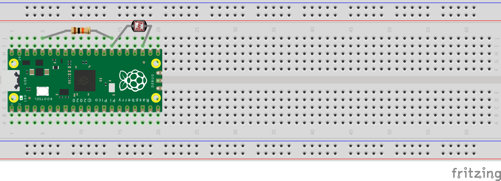
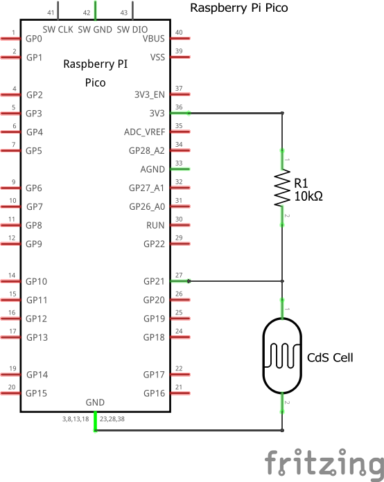
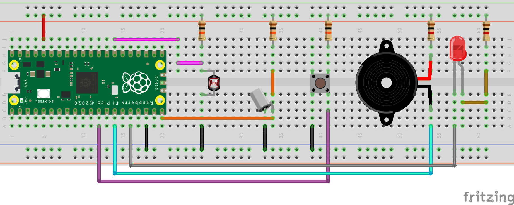
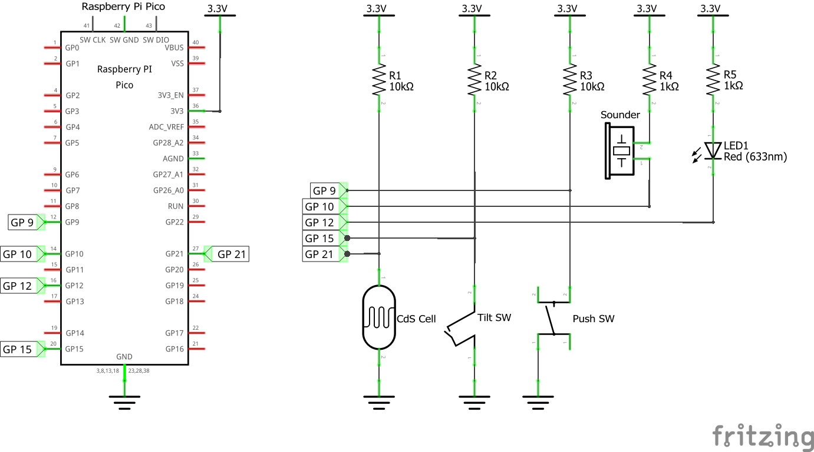

# Raspberry Pi Pico × PicoRuby ハンズオン資料 (#odewc)

このリポジトリは、2025年12月7日(日)に網走で開催される「Okhotsk DEW Community IT交流・勉強会」のハンズオン資料です。
Raspberry Pi Pico上でPicoRuby (R2P2) を動かし、光センサー（CdSセル）からのデータをUART通信でPCに送信するプログラムを実装します。
マイクロコントローラとPC間のシリアル通信の基礎を、Rubyを使って学習します。

イベント詳細: https://okhotsk-it.connpass.com/event/373766/

## 目次

- [ハードウェアについて](#ハードウェアについて)
- [R2P2について](#r2p2について)
- [シリアルポートの確認方法](#シリアルポートの確認方法)
- [電子部品の準備](#電子部品の準備)
- [回路の接続](#回路の接続)
- [PicoRubyについて](#picorubyについて)
- [配線の動作確認](#配線の動作確認)
- [今回実装するもの](#今回実装するもの)
- [PC側の準備](#pc側の準備)
- [ファイル構成](#ファイル構成)
- [Raspberry Pi Picoへのapp.rb書き込み手順](#raspberry-pi-picoへのapprb書き込み手順)
- [もっといろいろなことをしたい人へ](#もっといろいろなことをしたい人へ)
- [ハンズオンのまとめ](#ハンズオンのまとめ)
- [Rubyや電子工作のコミュニティとつながろう](#rubyや電子工作のコミュニティとつながろう)

## ハードウェアについて

### Raspberry Pi Pico
Raspberry Pi財団が開発した低価格マイクロコントローラボードです。
RP2040チップを搭載し、GPIO、ADC、I2C、SPI、UARTなどのインターフェースを備えています。
教育用途からIoTプロジェクトまで幅広く利用されています。

参考: https://www.raspberrypi.com/products/raspberry-pi-pico/

### RP2040
Raspberry Pi財団が独自に設計したマイクロコントローラチップです。
デュアルコアARM Cortex-M0+プロセッサ（最大133MHz）、264KBのSRAMを搭載しています。
プログラマブルI/O（PIO）機能により、柔軟なハードウェアインターフェースの実装が可能です。

参考: https://www.raspberrypi.com/products/rp2040/

## R2P2について

R2P2（Ruby Rapid Portable Platform）はPicoRubyで書かれたRaspberry Pi Pico用のシェルシステムで、Ruby言語を使ってマイクロコントローラを操作できます。

### R2P2のインストールとシェル接続の流れ

1. [GitHubのReleases](https://github.com/picoruby/R2P2/releases)から最新のUF2ファイルをダウンロードします。
2. Raspberry Pi PicoのBOOTSELボタンを押しながらUSBケーブルでPCに接続します。
3. Raspberry Pi PicoがRPI-RP2という名前のストレージデバイスとして認識されます。
4. ダウンロードしたUF2ファイルをRPI-RP2ドライブにドラッグ&ドロップします。
5. ファイルのコピーが完了すると、Raspberry Pi Picoが自動的に再起動し、R2P2が起動します。
6. シリアルポートを確認します（シリアルポートの確認方法は次章を参照）。
7. ターミナルエミュレータ（Windows: TeraTerm、Mac: screen、Linux: minicomなど）でシリアルポートに接続します（ボーレート115200）。
8. R2P2のシェルプロンプトが表示されれば接続成功です。

参考: https://github.com/picoruby/R2P2

## シリアルポートの確認方法

### Windows
デバイスマネージャーの「ポート (COMとLPT)」から確認できます。
コマンドラインでは `mode` コマンドで一覧表示が可能です。
Raspberry Pi Picoは通常 `COM3`、`COM4`、`COM5` などの形式で表示されます。

### Mac
ターミナルで `ls /dev/tty.*` または `ls /dev/cu.*` コマンドを実行します。
Raspberry Pi Picoは通常 `/dev/tty.usbmodem*` または `/dev/cu.usbmodem*` の形式で表示されます。
接続前後で `ls` の結果を比較すると、新しく追加されたデバイスを特定できます。

### Linux/Unix
ターミナルで `ls /dev/ttyACM*` または `ls /dev/ttyUSB*` コマンドを実行します。
`dmesg | grep tty` で接続時のカーネルログを確認することもできます。
Raspberry Pi Picoは通常 `/dev/ttyACM0` などの形式で表示されます。

### ターミナルエミュレータでの接続方法

シリアルポートを確認したら、ターミナルエミュレータを使用してRaspberry Pi Picoに接続します。

**Windows（TeraTerm）の場合：**
1. TeraTermを起動し、「シリアル」を選択します。
2. 確認したシリアルポート（例：COM5）を選択して接続します。
3. メニューから「設定」→「シリアルポート」を選び、ボーレートを `115200` に設定します。

**Mac（screen）の場合：**
```bash
screen /dev/tty.usbmodem* 115200
```

**Linux（minicom）の場合：**
```bash
minicom -D /dev/ttyACM0 -b 115200
```

接続が成功すると、R2P2のシェルプロンプトが表示されます。

## 電子部品の準備

このハンズオンを手元で体験したい方は、事前に秋月電子通商で必要な部品を購入してください。
ピンヘッダーのはんだづけが必要な場合は、ご自宅で作業を済ませてから会場にお越しください。

⚠️ **注意**: Raspberry Pi Pico ベーシックセットに付属のUSBケーブルはUSB-A to Micro-Bタイプです。
PCにUSB-Aポートがない場合（USB-Cのみの場合など）は、別途USB-C to Micro-B変換アダプタやケーブルを用意してください。

### 購入すべき部品（秋月電子通商）

**必須部品（1～4）：**

1. **Raspberry Pi Pico ベーシックセット**（ピンヘッダー・USBケーブル付属）
   https://akizukidenshi.com/catalog/g/g116149/

2. **CdSセル 5mmタイプ**（光センサー）
   https://akizukidenshi.com/catalog/g/g100110/

3. **カーボン抵抗 1/4W 10kΩ**
   https://akizukidenshi.com/catalog/g/g125103/

4. **ブレッドボード**（例：ブレッドボード EIC-801）
   https://akizukidenshi.com/catalog/g/gP-00315/

**推奨部品（もし興味があって他のこともやりたければ）：**

5. **ブレッドボード・ジャンパーワイヤ**（14種類×10本セットなど）
   https://akizukidenshi.com/catalog/g/g100288/

6. **タクトスイッチ**（例：黒色）
   https://akizukidenshi.com/catalog/g/g103647/

7. **圧電サウンダ**（例：SPT15）
   https://akizukidenshi.com/catalog/g/g104228/

8. **LED**（例：5mm赤色LED）
   https://akizukidenshi.com/catalog/g/g101318/

9. **カーボン抵抗 1/4W 100Ω**
   https://akizukidenshi.com/catalog/g/g125101/

10. **ティルトスイッチ（傾斜スイッチ）**
    https://akizukidenshi.com/catalog/c/ctiltsw/

11. **半固定抵抗 1kΩ**
    https://akizukidenshi.com/catalog/g/g108011/

⚠️ **注意**: 半固定抵抗は複数個購入しておくことを推奨します。半固定抵抗は固定抵抗でうまく回路が動作しないときの調整用として含めており、回路図上には記載されていません。

秋月電子通商: https://akizukidenshi.com/

## 回路の接続

⚠️ **注意**: 回路の配線を行う際には、必ずRaspberry Pi Picoの電源をOFFにしてください。電源をOFFにするには、USBケーブルをPCから外します。USBケーブルの抜き差しは、Raspberry Pi Pico側ではなくPC側で行うことを推奨します。

このプロジェクトでは、CdSセル（光センサー）と10kΩ抵抗を使った分圧回路を構成します。
3V3ピン（ピン36）から10kΩ抵抗を経由してCdSセルに接続し、CdSセルの他端をGNDピン（ピン38など）に接続します。
抵抗とCdSセルの接続点をGP27（ADC1、ピン32）に接続することで、光の強さに応じた電圧値をADCで読み取ることができます。

なお、Raspberry Pi Picoの裏面にはピン番号とピンの役割（GP番号、3V3、GNDなど）が印刷されているため、配線時に参照することができます。




上記の回路図と実体配線図は、Fritzingを使用して作成しました。
Fritzingは、電子工作のための回路図、ブレッドボード配線図、基板レイアウトを作成できるオープンソースのソフトウェアです。
グラフィカルインターフェースで視覚的な配線図を作成でき、教育用途やプロトタイピングに利用されています。

参考: https://fritzing.org/

### 配線チェック

配線が完了したら、以下の点を確認してください：

1. **3V3ピン（ピン36）** → 10kΩ抵抗 → CdSセル → **GNDピン（ピン38など）** の順に接続されているか
2. 10kΩ抵抗とCdSセルの接続点が **GP27（ADC1、ピン32）** に接続されているか
3. 各部品が確実にブレッドボードに挿入されているか（接触不良がないか）
4. 配線が回路図と一致しているか（ブレッドボード配線図と照らし合わせて確認）

## PicoRubyについて

PicoRubyはワンチップマイコン向けの最小Ruby実装です。
公式ドキュメントではPicoRubyの仕様、使い方、サンプルコードなどが詳しく紹介されています。
GitHubリポジトリではソースコードも公開されており、より深く学ぶことができます。

- 公式ドキュメント: https://picoruby.github.io/
- GitHubリポジトリ: https://github.com/picoruby/picoruby

## 配線の動作確認

⚠️ **注意**: 配線チェックを行うまでは、電源をOFF（USBケーブルは繋がない）のままにしておいてください。配線が完了してから、USBケーブルを接続して動作確認を行います。

配線が正しくできているかを確認するために、R2P2のirbで動作テストを行います。

### 1. Raspberry Pi Picoへの接続

「シリアルポートの確認方法」の章を参照して、ターミナルエミュレータでRaspberry Pi Picoに接続してください。
接続が成功すると、R2P2のシェルプロンプトが表示されます。

### 2. irbでのセンサー値確認

接続してR2P2のシェルが表示されたら、以下の手順でセンサー値を確認します。
ここで入力するRubyのコードはPicoRubyで実行されます。

1. `irb` と入力してEnterキーを押し、対話的Rubyシェルを起動します。
2. 以下のPicoRubyコードを1行ずつ入力して実行します：

```ruby
require 'adc'
sensor = ADC.new(27)
sensor.read_raw
```

3. CdSセルに手をかざして明るさを変えながら、何度か `sensor.read_raw` を実行します。
4. 明るいときと暗いときで値が変化すれば、配線が正しくできています。

**CdSセルの特性について：**
CdSセルは素子全体で光を受けて抵抗値が変動します。
そのため、手でCdSセル全体を包むように暗くすると、値の変化が大きくなります。

**期待される結果：**
- 明るいとき：小さい値（例：1000～2000程度）
- 暗いとき：大きい値（例：3000～4000程度）

値が変化しない場合は、配線を再確認してください。

## 今回実装するもの

このハンズオンでは、以下の2つのプログラムを実装します：

1. **Raspberry Pi Pico側（app.rb）**: GPIO27ピンに接続されたCdSセル（光センサー）からアナログ値を読み取り、シリアルポート経由でPCに送信し続けるプログラム
2. **PC側（serial-receiver.rb）**: シリアルポート経由でRaspberry Pi Picoから送信されるセンサーデータを受信し、画面に表示するプログラム

UART通信を使った基本的なセンサーデータの送受信を体験することで、マイクロコントローラとPC間のシリアル通信の仕組みを理解できます。

## PC側の準備

### Ruby環境のセットアップとserialport gemのインストール

PC側でserial-receiver.rbを実行するには、Rubyとserialport gemが必要です。

**1. Rubyのインストール確認**

ターミナル（WindowsならコマンドプロンプトまたはPowerShell）で以下を実行：
```bash
ruby -v
```
Ruby 3.0以降がインストールされていることを確認してください。インストールされていない場合：
- Windows: [RubyInstaller](https://rubyinstaller.org/) からインストール
- Mac: 標準でインストール済み、または `brew install ruby` でインストール
- Linux/Unix: `sudo apt install ruby` (Debian/Ubuntu) または `sudo yum install ruby` (CentOS/RHEL) でインストール

**2. serialport gemのインストール**

```bash
gem install serialport
```

**3. インストール確認**

```bash
gem list serialport
```
`serialport` が表示されれば正常にインストールされています。

## ファイル構成

### app.rb (Raspberry Pi Pico側)
Raspberry Pi Pico上でR2P2を使用して動作するプログラムです。
GPIO27ピンに接続されたADCセンサーから生データを読み取り、シリアルポート経由で送信します。

### serial-receiver.rb (PC側)
PC上でRuby 3.4を使用して動作する受信プログラムです。
シリアルポートを変数で指定し（今回のソースコードだとCOM5）、Raspberry Pi Picoから送信されたセンサーデータを受信して画面に表示します。

## Raspberry Pi Picoへのapp.rb書き込み手順

1. R2P2がインストールされたRaspberry Pi PicoをUSBケーブルでPCに接続します。
2. Raspberry Pi Picoがストレージデバイスとして認識され、ファイルエクスプローラーやFinderに表示されます。
3. Raspberry Pi Picoのストレージ内にある`/home`ディレクトリを開きます。
4. ローカルで編集したapp.rbファイルを`/home`ディレクトリにドラッグ・アンド・ドロップします。
5. `/home/app.rb`という名前で保存されていることを確認してください。この位置とファイル名で保存することで、Raspberry Pi Pico起動時に自動実行されます。
6. 新しいapp.rbを実行するために、USBケーブルを抜き差ししてRaspberry Pi Picoを再起動します。端子の耐久性を考慮して、PC側のUSB-Aコネクタで抜き差しすることを推奨します。

⚠️ **注意**: `/home`直下以外に保存したり、ファイル名を`app.rb`以外にすると自動実行されませんので、必ず`/home/app.rb`として保存してください。

## もっといろいろなことをしたい人へ

ハンズオンで使用した光センサー以外にも、様々なセンサーやアクチュエーターを接続して実験できます。
以下に、より複雑な回路例と、各部品の使い方を紹介します。




### 回路図の記号について

- **Vccまたは3.3V記号**: 電源のプラス側を示します。回路図では上向きの線や「3.3V」と書かれた記号で表され、Raspberry Pi Picoの3V3ピンに接続されます。
- **GND記号**: グランド（電源のマイナス側、基準電位）を示します。回路図では下向きの三角形や横線で表され、Raspberry Pi PicoのGNDピンに接続されます。
- **ネットレーベル**: 配線の名前（例：GP9、GP10など）を示します。同じネットレーベルの箇所は電気的に接続されていることを意味し、複雑な回路図を見やすくします。

### ティルトスイッチの使い方

ティルトスイッチは傾きを検出するセンサーで、内部の金属球が傾きによって移動し、接点のON/OFFを切り替えます。
上記回路図ではGP15ピンに外付けプルアップ抵抗（R2=10kΩ）を介して接続されており、通常時はHIGH、傾けるとLOWになります。

```ruby
require 'gpio'
tilt = GPIO.new(15, GPIO::IN)  # 外付け抵抗があるので内部プルアップは不要
tilt.read  # => 傾いていない: 1（HIGH）、傾いている: 0（LOW）
```

### タクトスイッチ（プッシュスイッチ）の使い方

タクトスイッチはボタンを押している間だけONになるスイッチです。
上記回路図ではGP10ピンに外付けプルアップ抵抗（R3=10kΩ）を介して接続されており、通常時はHIGH、押すとLOWになります。

```ruby
require 'gpio'
button = GPIO.new(10, GPIO::IN)  # 外付け抵抗があるので内部プルアップは不要
button.read  # => 押していない: 1（HIGH）、押している: 0（LOW）
```

### 圧電サウンダの使い方

圧電サウンダは電圧を加えると音を鳴らす部品です。PWM（パルス幅変調）で周波数を変えることで、音程を変えられます。
上記回路図ではGP9ピンに電流制限抵抗（R4=100Ω）を介して接続されています。

```ruby
require 'pwm'
buzzer = PWM.new(9)
buzzer.freq(440)   # 440Hzの音（ラの音）を設定
buzzer.duty(50)    # デューティ比50%で音を鳴らす
buzzer.duty(0)     # デューティ比0%で音を止める
```

### LEDの使い方

LEDは電流を流すと光る部品で、デジタル出力で点灯・消灯を制御できます。
上記回路図ではGP12ピンに電流制限抵抗（R5=100Ω）を介して接続されています。

```ruby
require 'gpio'
led = GPIO.new(12, GPIO::OUT)
led.write(1)  # LED点灯（HIGH出力）
led.write(0)  # LED消灯（LOW出力）
```

## ハンズオンのまとめ

このハンズオンでは、Raspberry Pi PicoにR2P2をインストールし、PicoRubyを使ってマイクロコントローラプログラミングの基礎を学びました。
CdSセル（光センサー）を使った回路を構築し、センサーから読み取ったアナログ値をUART通信でPCに送信するシステムを実装しました。
PC側ではRubyでシリアルポートからデータを受信し、リアルタイムに表示するプログラムを作成しました。

Ruby言語でマイクロコントローラを操作できることで、電子工作に挑戦できます。
今後は、タクトスイッチ、LED、圧電サウンダ、ティルトスイッチなど様々な部品を組み合わせて、より複雑で実用的なプログラムに挑戦してみてください。
温度センサーを使った環境モニタリングシステムや、モーターを使った自動制御装置など、様々な応用が可能です。

PicoRubyとRaspberry Pi Picoを使った電子工作を通じて、ソフトウェアとハードウェアの両方の知識を習得し、IoTデバイスの制作や組み込みシステム開発のスキルを向上させることができます。
さらに学習を発展させるには、次章で紹介するコミュニティへの参加も有効です。
コミュニティに参加することで、他の人の作品から学び、自分の作品を共有することが可能です。

## Rubyや電子工作のコミュニティとつながろう

### PicoPicoRubyコミュニティ

PicoPicoRubyは、PicoRubyの相互扶助コミュニティです。
月1回のペースでオフラインで集まって交流し、自分の作ったものを見せ合ったり、作業をしたり、雑談したりしています。
初心者から経験者まで、PicoRubyに興味がある方はぜひご参加ください。

- Connpassページ: https://picopicoruby.connpass.com/

### FuraIT（ふらいと）

FuraITは富良野市で活動するITコミュニティで、Arduino部が活発に活動しています。
Arduino部ではDiscordの音声チャンネルを使って定期的に勉強会を開催し、電子工作初心者から経験者まで参加しています。
北海道内で電子工作に取り組む方が参加できるコミュニティです。

- Connpassページ: https://furait.connpass.com/
- 活動ブログ: https://furait.hatenablog.jp/

### RubyKaigi 2026（函館開催）

RubyKaigi 2026は、2026年4月22日（水）〜24日（金）に函館で開催される日本最大級のRubyカンファレンスです。
RubyKaigiとして初めて北海道での開催となり、世界中からRubyistが集まります。
Rubyに興味がある方、より深く学びたい方はぜひ参加をご検討ください。

- 公式サイト: https://rubykaigi.org/2026/
