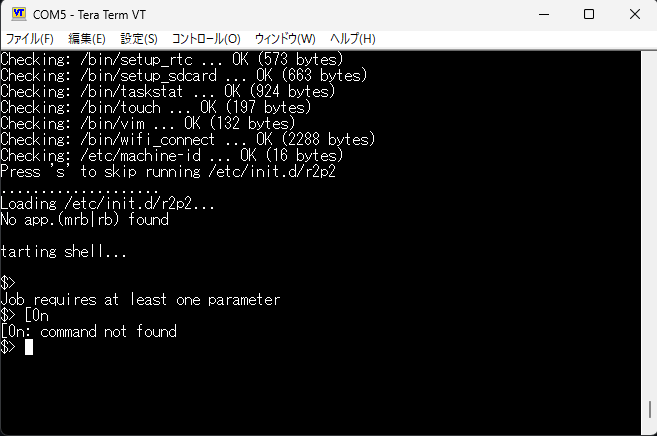
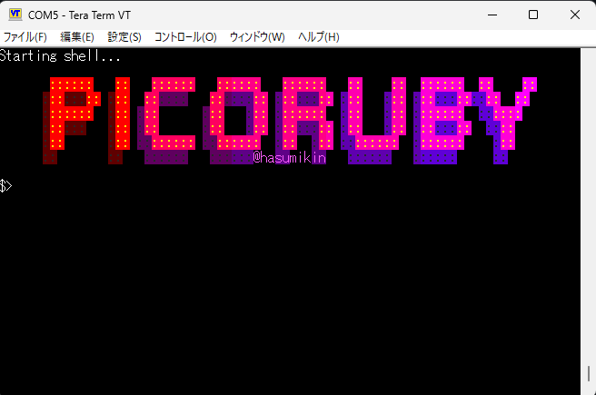
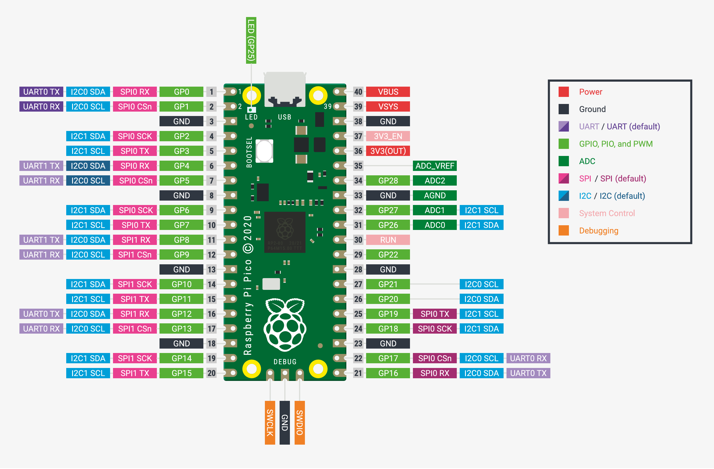
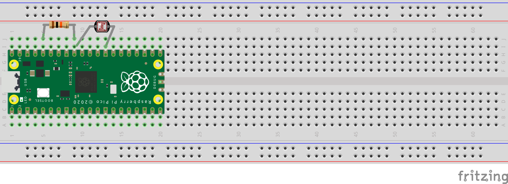
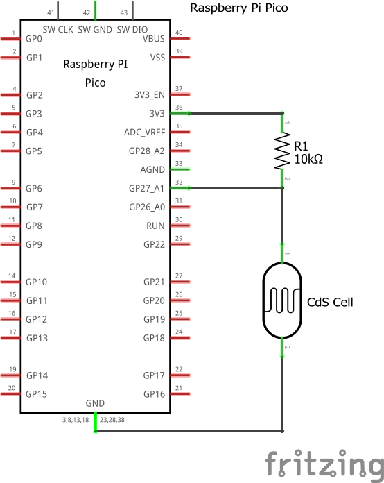
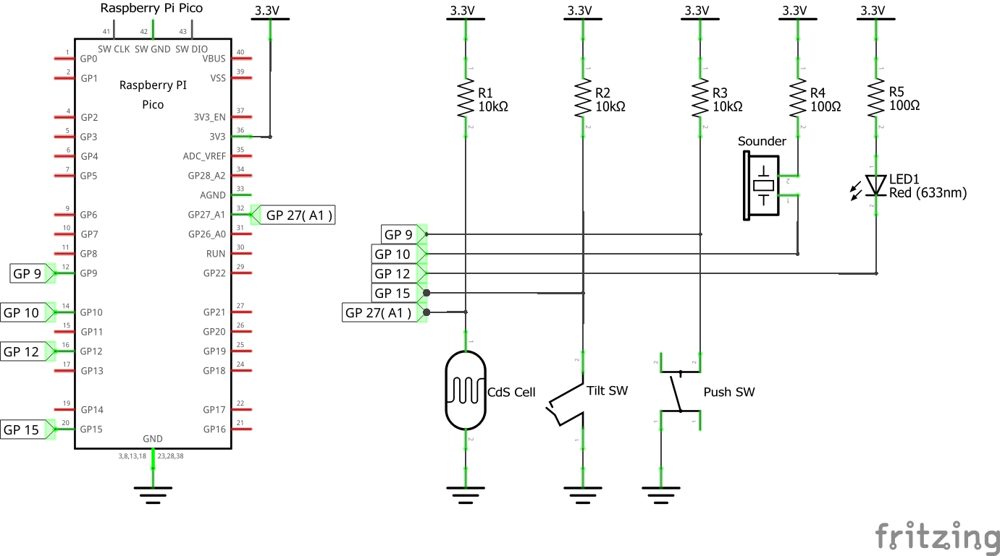

# Raspberry Pi Pico × PicoRuby ハンズオン資料 (#odewc)

このリポジトリは、2025年12月7日(日)に網走で開催される「Okhotsk DEW Community IT交流・勉強会」のハンズオン資料です。
Raspberry Pi Pico上でPicoRuby (R2P2) を動かし、光センサー（CdSセル）からのデータをUART通信でPCに送信するプログラムを実装します。
マイクロコントローラとPC間のシリアル通信の基礎を、Rubyを使って学習します。

⚠️ **ご自身で体験される方へ**: このハンズオンを実際に体験するには、Raspberry Pi Picoや電子部品などの準備が必要です。必要な部品については「[📕 電子部品の準備](#-電子部品の準備)」のセクションを参照してください。

イベント詳細: https://okhotsk-it.connpass.com/event/373766/

## 📕 目次

- [PicoRubyについて](#-picorubyについて)
- [ハードウェアについて](#-ハードウェアについて)
- [電子部品の準備](#-電子部品の準備)
- [R2P2について](#-r2p2について)
- [シリアルポートの確認方法](#-シリアルポートの確認方法)
- [回路の接続](#-回路の接続)
- [配線の動作確認](#-配線の動作確認)
- [今回実装するもの](#-今回実装するもの)
- [PC側の準備](#-pc側の準備)
- [ファイル構成](#-ファイル構成)
- [Raspberry Pi Picoへのapp.rb書き込み手順](#-raspberry-pi-picoへのapprb書き込み手順)
- [動作確認](#-動作確認)
- [挑戦してみよう](#-挑戦してみよう)
- [もっといろいろなことをしたい人へ](#-もっといろいろなことをしたい人へ)
- [組み合わせてみよう](#-組み合わせてみよう)
- [ハンズオンのまとめ](#-ハンズオンのまとめ)
- [Rubyや電子工作のコミュニティとつながろう](#-rubyや電子工作のコミュニティとつながろう)

## 📕 PicoRubyについて

PicoRubyはワンチップマイコン向けの最小Ruby実装です。
公式ドキュメントではPicoRubyの仕様、使い方、サンプルコードなどが詳しく紹介されています。
GitHubリポジトリではソースコードも公開されており、より深く学べます。

- 公式ドキュメント: https://picoruby.github.io/
- GitHubリポジトリ: https://github.com/picoruby/picoruby

⚠️ **注意**: 今後この資料で出てくるRubyコードのうち、Raspberry Pi Picoに保存して動作させるものについては、PicoRubyで動作するコードです。PC側で動作させるコードは通常のRuby（CRuby）で実行されます。

## 📕 ハードウェアについて

### 📗 Raspberry Pi Pico
Raspberry Pi財団が開発したマイクロコントローラボードです。
RP2040チップを搭載し、GPIO、ADC、I2C、SPI、UARTなどのインターフェースを備えています。
教育用途やIoTプロジェクトなどで利用されています。

参考: https://www.raspberrypi.com/products/raspberry-pi-pico/

### 📗 RP2040
Raspberry Pi財団が独自に設計したマイクロコントローラチップです。
デュアルコアARM Cortex-M0+プロセッサ（最大133MHz）、264KBのSRAMを搭載しています。
プログラマブルI/O（PIO）機能により、カスタムハードウェアインターフェースを実装できます。

参考: https://www.raspberrypi.com/products/rp2040/

## 📕 電子部品の準備

このハンズオンを手元で体験したい方は、事前に秋月電子通商で必要な部品を購入してください。
ピンヘッダーのはんだづけが必要な場合は、ご自宅で作業を済ませてから会場にお越しください。

⚠️ **注意**: Raspberry Pi Pico ベーシックセットに付属のUSBケーブルはUSB-A to Micro-Bタイプです。
PCにUSB-Aポートがない場合（USB-Cのみの場合など）は、別途USB-C to Micro-B変換アダプタやケーブルを用意してください。

### 📗 購入すべき部品（秋月電子通商）

**必須部品（1～4）：**

1. **Raspberry Pi Pico ベーシックセット**（ピンヘッダー・USBケーブル付属）
   https://akizukidenshi.com/catalog/g/g116149/

2. **CdSセル 5mmタイプ**（光センサー）
   https://akizukidenshi.com/catalog/g/g100110/

3. **カーボン抵抗 1/4W 10kΩ**
   https://akizukidenshi.com/catalog/g/g125103/

4. **ブレッドボード**（例：ブレッドボード EIC-801）
   https://akizukidenshi.com/catalog/g/gP-00315/

   ⚠️ もしほかにもいろいろなことをやりたい場合は、もう一個追加で購入するか、ワンサイズ大きなブレッドボードを購入することを推奨します。

**推奨部品（もし興味があって他のこともやりたければ）：**

5. **ブレッドボード・ジャンパーワイヤ**
   - 5.1. **かため**（14種類×10本セットなど）
     https://akizukidenshi.com/catalog/g/g100288/
   - 5.2. **やわらかめ**
     https://akizukidenshi.com/catalog/g/g130088/

   💡 かためのワイヤーはブレッドボードの配線がごちゃつかない利点があり、やわらかめのワイヤーは離れたところ同士の配線がしやすいため、両方の種類があると便利です。

6. **タクトスイッチ**（例：黒色）
   https://akizukidenshi.com/catalog/g/g103647/

7. **圧電サウンダ**（例：SPT15）
   https://akizukidenshi.com/catalog/g/g104118/

8. **LED**（例：5mm赤色LED）
   https://akizukidenshi.com/catalog/g/g101318/

9. **カーボン抵抗 1/4W 100Ω**
   https://akizukidenshi.com/catalog/g/g125101/

10. **ティルトスイッチ（傾斜スイッチ）**
    https://akizukidenshi.com/catalog/c/ctiltsw/

11. **半固定抵抗 1kΩ**
    https://akizukidenshi.com/catalog/g/g108011/

⚠️ **注意**: 半固定抵抗は複数個購入しておくことを推奨します。半固定抵抗は固定抵抗でうまく回路が動作しないときの調整用として含めており、回路図上には記載されていません。

秋月電子通商: https://akizukidenshi.com/

## 📕 R2P2について

R2P2（Ruby Rapid Portable Platform）はPicoRubyで書かれたRaspberry Pi Pico用のシェルシステムで、Ruby言語を使ってマイクロコントローラを操作できます。

### 📗 R2P2のインストールとシェル接続の流れ

1. [GitHubのReleases](https://github.com/picoruby/R2P2/releases)から最新のUF2ファイルをダウンロードします。
2. Raspberry Pi PicoのBOOTSELボタンを押しながらUSBケーブルでPCに接続します。
3. Raspberry Pi PicoがRPI-RP2という名前のストレージデバイスとして認識されます。
4. ダウンロードしたUF2ファイルをRPI-RP2ドライブにドラッグ&ドロップします。
5. ファイルのコピーが完了すると、Raspberry Pi Picoが自動的に再起動し、R2P2が起動します。
6. シリアルポートを確認します（シリアルポートの確認方法は次章を参照）。
7. ターミナルエミュレータ（Windows: TeraTerm、Mac: screen、Linux: minicomなど）でシリアルポートに接続します（ボーレート115200）。
8. R2P2のシェルプロンプトが表示されれば接続成功です。

参考: https://github.com/picoruby/R2P2

### 📗 R2P2シェルの接続トラブルシューティング

ターミナルで接続しても画面が黒いままで何も表示されない場合があります。
そのようなときは、Enterキーや他のキーを何度か押してみると、R2P2シェルのプロンプトが表示されることがあります。
なお、これは応急的な対処法であり、正しい接続手順がある場合はそちらに従ってください。

画面に`$>`と表示されたら、R2P2のシェルに入れています。
このシェルでは`ls`、`pwd`、`cat`などの基本的なUnixコマンドも動作します。
また、`irb`と入力することで対話的Rubyシェルを起動できます。



また、一度接続が確立した後に、ターミナルをそのままにした状態でUSBケーブルを抜き差しすると、ロゴが正しく表示される場合があります。
ただし、この方法は少々乱暴なため、他の方法で解決できる場合はそちらを優先してください。
USBケーブルの抜き差しは、Raspberry Pi Pico側ではなくPC側で行うことを推奨します。



## 📕 シリアルポートの確認方法

### 📗 Windows
デバイスマネージャーの「ポート (COMとLPT)」から確認できます。
コマンドラインでは `mode` コマンドで一覧を表示できます。
Raspberry Pi Picoは通常 `COM3`、`COM4`、`COM5` などの形式で表示されます。

### 📗 Mac
ターミナルで `ls /dev/tty.*` または `ls /dev/cu.*` コマンドを実行します。
Raspberry Pi Picoは通常 `/dev/tty.usbmodem*` または `/dev/cu.usbmodem*` の形式で表示されます。
接続前後で `ls` の結果を比較すると、新しく追加されたデバイスを特定できます。

### 📗 Linux/Unix
ターミナルで `ls /dev/ttyACM*` または `ls /dev/ttyUSB*` コマンドを実行します。
`dmesg | grep tty` で接続時のカーネルログも確認できます。
Raspberry Pi Picoは通常 `/dev/ttyACM0` などの形式で表示されます。

### 📗 ターミナルエミュレータでの接続方法

シリアルポートを確認したら、ターミナルエミュレータを使用してRaspberry Pi Picoに接続します。

**Windows（TeraTerm）の場合：**
1. TeraTermを起動し、「シリアル」を選択します。
2. 確認したシリアルポート（例：COM5）を選択して接続します。
3. メニューから「設定」→「シリアルポート」を選び、ボーレートを `115200` に設定します。

**Mac（screen）の場合：**
```bash
screen /dev/tty.usbmodem* 115200
```

**Linux（minicom）の場合：**
```bash
minicom -D /dev/ttyACM0 -b 115200
```

接続が成功すると、R2P2のシェルプロンプトが表示されます。

## 📕 回路の接続

⚠️ **注意**: 回路の配線を行う際には、必ずRaspberry Pi Picoの電源をOFFにしてください。電源をOFFにするには、USBケーブルをPCから外します。USBケーブルの抜き差しは、Raspberry Pi Pico側ではなくPC側で行うことを推奨します。

### 📗 Raspberry Pi Pico のピンアサイン（ピン配置）

Raspberry Pi Pico には 40 本のピンがあり，それぞれに異なる機能が割り当てられています。
以下の図は，各ピンの機能と配置を示しています。



図 1: Raspberry Pi Pico のピンアサイン（ピン配置図）

**このハンズオンで使用する主なピン:**

- **3V3（ピン36）**: 3.3V電源出力で，センサーや周辺回路に電源を供給します。
- **GND（ピン38など）**: グランド（マイナス側）で，回路の基準電位として使用します。
- **GP27（ADC1，ピン32）**: アナログ入力ピンで，CdSセルからの電圧を読み取ります。

⚠️ **注意**:
- 同じピンが複数の機能に対応している場合，同時に複数の機能を使用することはできません。
- 3V3 ピンからの電流供給には上限があるため，消費電力の大きいデバイスを接続する際は注意してください。
- Raspberry Pi Pico の裏面にもピン番号とピンの役割（GP 番号，3V3，GND など）が印刷されており，配線時に参照できます。
- PicoRuby でピンを指定する際は，物理的なピン番号ではなく **GPIO 番号（GP 番号）** を使用します。

**出典**: 上記のピンアサイン図は，[Raspberry Pi Pico Datasheet (RP-008307-DS)](https://pip-assets.raspberrypi.com/categories/610-raspberry-pi-pico/documents/RP-008307-DS-1-pico-datasheet.pdf?disposition=inline) の p.4 より引用しました。

### 📗 このハンズオンで使用するピン

このプロジェクトでは、CdSセル（光センサー）と10kΩ抵抗を使った分圧回路を構成します。
3V3ピン（ピン36）から10kΩ抵抗を経由してCdSセルに接続し、CdSセルの他端をGNDピン（ピン38など）に接続します。
抵抗とCdSセルの接続点をGP27（ADC1、ピン32）に接続することで、光の強さに応じた電圧値をADCで読み取れます。

なお、Raspberry Pi Picoの裏面にはピン番号とピンの役割（GP番号、3V3、GNDなど）が印刷されているため、配線時に参照できます。




上記の回路図と実体配線図は、Fritzingを使用して作成しました。
Fritzingは、電子工作のための回路図、ブレッドボード配線図、基板レイアウトを作成できるオープンソースのソフトウェアです。
グラフィカルインターフェースで配線図を作成でき、教育用途やプロトタイピングに利用されています。

参考: https://fritzing.org/

### 📗 配線チェック

配線が完了したら、以下の点を確認してください：

1. **3V3ピン（ピン36）** → 10kΩ抵抗 → CdSセル → **GNDピン（ピン38など）** の順に接続されているか
2. 10kΩ抵抗とCdSセルの接続点が **GP27（ADC1、ピン32）** に接続されているか
3. 各部品が確実にブレッドボードに挿入されているか（接触不良がないか）
4. 配線が回路図と一致しているか（ブレッドボード配線図と照らし合わせて確認）

## 📕 配線の動作確認

⚠️ **注意**: 配線チェックを行うまでは、電源をOFF（USBケーブルは繋がない）のままにしておいてください。配線が完了してから、USBケーブルを接続して動作確認を行います。

配線が正しくできているかを確認するために、R2P2のirbで動作テストを行います。

### 📗 1. Raspberry Pi Picoへの接続

「シリアルポートの確認方法」の章を参照して、ターミナルエミュレータでRaspberry Pi Picoに接続してください。
接続が成功すると、R2P2のシェルプロンプトが表示されます。

### 📗 2. irbでのセンサー値確認

接続してR2P2のシェルが表示されたら、以下の手順でセンサー値を確認します。
ここで入力するRubyのコードはPicoRubyで実行されます。

1. `irb` と入力してEnterキーを押し、対話的Rubyシェルを起動します。
2. 以下のPicoRubyコードを1行ずつ入力して実行します：

```ruby
require 'adc'
sensor = ADC.new(27)
sensor.read_raw
```

⚠️ **注意**: `ADC.new(27)` の `27` は **GP27（GPIO番号）** を指しており，物理的なピン番号（ピン32）とは異なります。PicoRuby では GPIO 番号を使用してピンを指定します。

3. CdSセルに手をかざして明るさを変えながら、何度か `sensor.read_raw` を実行します。
4. 明るいときと暗いときで値が変化すれば、配線が正しくできています。

**CdSセルの特性について：**
CdSセルは素子全体で光を受けて抵抗値が変動します。
そのため、手でCdSセル全体を包むように暗くすると、値の変化が大きくなります。

**期待される結果：**
- 明るいとき：小さい値（例：1000～2000程度）
- 暗いとき：大きい値（例：3000～4000程度）

値が変化しない場合は、配線を再確認してください。

## 📕 今回実装するもの

このハンズオンでは、以下の2つのプログラムを実装します：

1. **Raspberry Pi Pico側（app.rb）**: GPIO27ピンに接続されたCdSセル（光センサー）からアナログ値を読み取り、シリアルポート経由でPCに送信し続けるプログラム
2. **PC側（serial-receiver.rb）**: シリアルポート経由でRaspberry Pi Picoから送信されるセンサーデータを受信し、画面に表示するプログラム

UART通信を使った基本的なセンサーデータの送受信を体験することで、マイクロコントローラとPC間のシリアル通信の仕組みを理解できます。

## 📕 PC側の準備

### 📗 Ruby環境のセットアップとserialport gemのインストール

PC側でserial-receiver.rbを実行するには、Rubyとserialport gemが必要です。

**1. Rubyのインストール確認**

ターミナル（WindowsならコマンドプロンプトまたはPowerShell）で以下を実行：
```bash
ruby -v
```
Ruby 3.0以降がインストールされていることを確認してください。インストールされていない場合：
- Windows: [RubyInstaller](https://rubyinstaller.org/) からインストール
- Mac: 標準でインストール済み、または `brew install ruby` でインストール
- Linux/Unix: `sudo apt install ruby` (Debian/Ubuntu) または `sudo yum install ruby` (CentOS/RHEL) でインストール

**2. serialport gemのインストール**

```bash
gem install serialport
```

**3. インストール確認**

```bash
gem list serialport
```
`serialport` が表示されれば正常にインストールされています。

## 📕 ファイル構成

### 📗 app.rb (Raspberry Pi Pico側)
Raspberry Pi Pico上でR2P2を使用して動作するプログラムです。
GPIO27ピンに接続されたADCセンサーから生データを読み取り、シリアルポート経由で送信します。

### 📗 serial-receiver.rb (PC側)
PC上でRuby 3.4を使用して動作する受信プログラムです。
シリアルポートを変数で指定し（今回のソースコードだとCOM5）、Raspberry Pi Picoから送信されたセンサーデータを受信して画面に表示します。

⚠️ **注意**: app.rbとserial-receiver.rbはいずれもPC上で編集してください。Raspberry Pi Pico上のフラッシュメモリで直接編集すると、書き込み回数が増加します。フラッシュメモリなどの半導体メモリには書き込み回数の上限（通常10万回程度）があるため、頻繁な書き込みを避けることでデバイスを長持ちさせられます。

## 📕 Raspberry Pi Picoへのapp.rb書き込み手順

1. R2P2がインストールされたRaspberry Pi PicoをUSBケーブルでPCに接続します。
2. Raspberry Pi Picoがストレージデバイスとして認識され、ファイルエクスプローラーやFinderに表示されます。
3. Raspberry Pi Picoのストレージ内にある`/home`ディレクトリを開きます。
4. ローカルで編集したapp.rbファイルを`/home`ディレクトリにドラッグ・アンド・ドロップします。
5. `/home/app.rb`という名前で保存されていることを確認してください。この位置とファイル名で保存することで、Raspberry Pi Pico起動時に自動実行されます。
6. 新しいapp.rbを実行するために、USBケーブルを抜き差ししてRaspberry Pi Picoを再起動します。端子の耐久性を考慮して、PC側のUSB-Aコネクタで抜き差しすることを推奨します。

⚠️ **注意**: `/home`直下以外に保存したり、ファイル名を`app.rb`以外にすると自動実行されませんので、必ず`/home/app.rb`として保存してください。

## 📕 動作確認

app.rbとserial-receiver.rbの両方を準備できたら、実際に動作させてセンサーデータが正しく送受信されることを確認しましょう。

### 📗 Raspberry Pi Pico側の動作手順

1. 前述の「Raspberry Pi Picoへのapp.rb書き込み手順」に従って、app.rbを`/home`ディレクトリに保存します。
2. USBケーブルを抜き差ししてRaspberry Pi Picoを再起動します。PC側のUSB-Aコネクタで抜き差しすることを推奨します。
3. 再起動後、app.rbが自動実行され、センサーデータの送信が開始されます。

### 📗 PC側の動作手順

1. ターミナル（WindowsならコマンドプロンプトまたはPowerShell）を開きます。
2. serial-receiver.rbがあるディレクトリに移動します。
3. 必要に応じてserial-receiver.rb内のシリアルポート名（例：COM5、/dev/tty.usbmodem*など）を環境に合わせて編集します。
4. 以下のコマンドでserial-receiver.rbを実行します：
   ```bash
   ruby serial-receiver.rb
   ```
5. センサーデータが画面に表示されることを確認します。CdSセルに手をかざして明るさを変えると、値が変化するはずです。
6. プログラムを終了するには、`Ctrl+C`（Windowsの場合はCtrl+C、Macの場合はControl+C）を押します。

### 📗 動作確認の様子

以下は、Raspberry Pi PicoとPC側のプログラムが正常に動作している様子です。


## 📕 挑戦してみよう

基本的な動作確認ができたら、PC側のプログラム（serial-receiver.rb）を改造して、追加機能を実装してみましょう。
以下の課題は、回路やRaspberry Pi Pico側のapp.rbを変更せずに取り組めます。

### 📗 課題1: 明るさ判定機能を追加する

受信したセンサー値を閾値と比較して、「明るい」または「暗い」を表示する機能を実装します。

**実装のヒント:**
- 受信した値を整数に変換して閾値（例：2500）と比較します。
- 条件分岐（if文）を使って判定結果を表示します。
- 閾値は環境に応じて調整してください。

**期待される動作例:**
```
2048 → 明るい
3856 → 暗い
```

### 📗 課題2: テキストベースのグラフ表示を実装する

受信したセンサー値を視覚的に表現するため、テキストベースのバーグラフを表示する機能を実装します。

**実装のヒント:**
- センサー値をスケーリングして、文字列（例：'#'や'='）を繰り返し表示します。
- 値の範囲（0～4095）をグラフの長さ（例：0～50文字）に変換します。
- `"#" * (value / 100)` のような式で繰り返し文字列を生成できます。

**期待される動作例:**
```
2048: ####################
3856: ######################################
```

### 📗 課題3: センサーデータをCSVファイルに記録する

受信したセンサー値をタイムスタンプ付きでCSVファイルに保存し、後で分析できるようにします。

**実装のヒント:**
- `File.open`を使ってCSVファイルを開きます（追記モード'a'を使用）。
- `Time.now`で現在時刻を取得します。
- カンマ区切りで「タイムスタンプ,センサー値」の形式で書き込みます。
- プログラム終了時にファイルが確実に閉じられるよう、ensureブロックを使用します。

**期待されるCSVファイルの内容例:**
```
2025-12-07 14:30:15,2048
2025-12-07 14:30:16,2051
2025-12-07 14:30:17,3856
```

これらの課題に取り組むことで、Rubyでのデータ処理、条件分岐、ファイル操作の基礎を習得できます。
複数の機能を組み合わせて、グラフ表示とファイル記録を同時に行うプログラムに発展させることもできます。

## 📕 もっといろいろなことをしたい人へ

ハンズオンで使用した光センサー以外にも、様々なセンサーやアクチュエーターを接続して実験できます。
以下に、複数の部品を組み合わせた回路例と、各部品の使い方を紹介します。




### 📗 回路図の記号について

- **Vccまたは3.3V記号**: 電源のプラス側を示します。回路図では上向きの線や「3.3V」と書かれた記号で表され、Raspberry Pi Picoの3V3ピンに接続されます。
- **GND記号**: グランド（電源のマイナス側、基準電位）を示します。回路図では下向きの三角形や横線で表され、Raspberry Pi PicoのGNDピンに接続されます。
- **ネットレーベル**: 配線の名前（例：GP9、GP10など）を示します。同じネットレーベルの箇所は電気的に接続されていることを意味し、複雑な回路図を見やすくします。

### 📗 各部品の注意事項

**抵抗の値の読み方:**
カーボン抵抗は、抵抗値をカラーコード（色の帯）で表しています。
例えば、10kΩの抵抗は「茶・黒・橙・金」の4本の帯があり、最初の3本で値を、最後の1本で誤差を表します。
抵抗のカラーコード表を参照して、正しい抵抗値であることを確認してから使用してください。
秋月電子通商のサイトや、カラーコード計算ツールを活用すると便利です。

**LEDの極性:**
LEDには極性（プラスとマイナス）があり、正しい向きに接続しないと点灯しません。
一般的に、足が長い方がアノード（プラス側）、短い方がカソード（マイナス側）です。
また、LED本体を横から見ると、カソード側が平らに削られていることがあります。
回路図では、三角形の先端がカソード側を示しています。

**タクトスイッチの内部構造:**
タクトスイッチには4本の端子がありますが、内部で既に導通しているピン同士があります。
通常、対角線上のピン同士が独立しており、ボタンを押すとこれらが接続される構造になっています。
ブレッドボードに挿入する際は、スイッチの向きに注意してください。
向きを間違えると、常に導通している状態になってしまい、スイッチとして機能しません。

### 📗 ティルトスイッチの使い方

ティルトスイッチは傾きを検出するセンサーで、内部の金属球が傾きによって移動し、接点のON/OFFを切り替えます。
上記回路図ではGP15ピンに外付けプルアップ抵抗（R2=10kΩ）を介して接続されており、通常時はHIGH、傾けるとLOWになります。

```ruby
require 'gpio'
tilt = GPIO.new(15, GPIO::IN)  # 外付け抵抗があるので内部プルアップは不要
tilt.read  # => 傾いていない: 1（HIGH）、傾いている: 0（LOW）
```

### 📗 タクトスイッチ（プッシュスイッチ）の使い方

タクトスイッチはボタンを押している間だけONになるスイッチです。
上記回路図ではGP10ピンに外付けプルアップ抵抗（R3=10kΩ）を介して接続されており、通常時はHIGH、押すとLOWになります。

```ruby
require 'gpio'
button = GPIO.new(10, GPIO::IN)  # 外付け抵抗があるので内部プルアップは不要
button.read  # => 押していない: 1（HIGH）、押している: 0（LOW）
```

### 📗 圧電サウンダの使い方

圧電サウンダは電圧を加えると音を鳴らす部品です。PWM（パルス幅変調）で周波数を変えることで、音程を変えられます。
上記回路図ではGP9ピンに電流制限抵抗（R4=100Ω）を介して接続されています。

```ruby
require 'pwm'
buzzer = PWM.new(9)
buzzer.freq(440)   # 440Hzの音（ラの音）を設定
buzzer.duty(50)    # デューティ比50%で音を鳴らす
buzzer.duty(0)     # デューティ比0%で音を止める
```

### 📗 LEDの使い方

LEDは電流を流すと光る部品で、デジタル出力で点灯・消灯を制御できます。
上記回路図ではGP12ピンに電流制限抵抗（R5=100Ω）を介して接続されています。

**デジタル出力による点灯・消灯:**
```ruby
require 'gpio'
led = GPIO.new(12, GPIO::OUT)
led.write(1)  # LED点灯（HIGH出力）
led.write(0)  # LED消灯（LOW出力）
```

**PWMによるアナログ出力（明るさ制御）:**

PWM（パルス幅変調）を使用することで、LEDの明るさを連続的に制御できます。
デューティ比（0～100%）を変えることで、見かけ上の明るさを調整します。

```ruby
require 'pwm'
led = PWM.new(12)
led.freq(1000)   # 周波数を1000Hzに設定（ちらつき防止）
led.duty(100)    # デューティ比100%（最大の明るさ）
led.duty(50)     # デューティ比50%（中程度の明るさ）
led.duty(10)     # デューティ比10%（暗い）
led.duty(0)      # デューティ比0%（消灯）
```

PWMを使用すれば、フェードイン・フェードアウト効果や、センサー値に応じた明るさ調整などのLED制御ができます。

## 📕 組み合わせてみよう

複数のセンサーやアクチュエーターを組み合わせることで、複合的なシステムを構築できます。
ここでは、レベルアップ用回路のデバイス（CdSセル、ティルトスイッチ、タクトスイッチ、圧電サウンダ、LED）を組み合わせた課題を紹介します。
これらの課題では、Raspberry Pi Pico側（app.rb）とPC側（serial-receiver.rb）の両方のプログラムを改造します。

### 📗 課題1: 光センサーと連動する音階システム

CdSセルで測定した明るさに応じて、圧電サウンダから異なる音階を鳴らすシステムを実装します。

**必要なデバイス:**
- CdSセル（GP27）
- 圧電サウンダ（GP9）

**実装の方向性:**
- **app.rb側**: CdSセルの値を読み取り、センサー値をシリアル送信します。圧電サウンダはPWMで制御し、周波数を変えることで音階を変化させます。
- **serial-receiver.rb側**: 受信したセンサー値を適切な周波数（例：ドレミファソラシド）に変換し、app.rb側に音階データを送り返す仕組みを実装することも可能です。あるいは、app.rb側で独立して明るさに応じた周波数を計算し、PC側は監視やログ表示に専念する設計も考えられます。

**期待される動作:**
- 明るいとき：高い音（例：880Hz、ラの音）
- 暗いとき：低い音（例：262Hz、ドの音）
- センサー値に応じて連続的に音階が変化

### 📗 課題2: 傾き検知LED警告システム

ティルトスイッチで傾きを検知し、傾いている間LEDを点灯させる警告システムを実装します。
デジタル出力での単純な点灯・消灯に加えて、PWMを使った点滅効果や明るさ制御にも挑戦できます。

**必要なデバイス:**
- ティルトスイッチ（GP15）
- LED（GP12）

**実装の方向性:**
- **app.rb側**: ティルトスイッチの状態を読み取り、傾きを検知したらLEDを点灯させます。同時に状態をシリアル送信してPC側に通知します。PWMを使用して点滅効果を追加することもできます。
- **serial-receiver.rb側**: 受信した傾き状態を画面に表示し、傾き検知の履歴や統計情報（傾いた回数、時間など）を記録します。

**期待される動作:**
- 通常時：LED消灯、PC画面に「正常」表示
- 傾いたとき：LED点灯または点滅、PC画面に「警告：傾きを検知しました」表示
- 傾きの履歴をPC側で記録

**発展課題:**
PWMを使用して、傾いている時間の長さに応じてLEDの明るさや点滅速度を変化させる警告レベルシステムを実装できます。

### 📗 課題3: ボタン制御による明るさ連動LEDシステム

タクトスイッチを押している間だけ、CdSセルの明るさに応じてLEDを制御するシステムを実装します。
LEDの点滅速度を変化させる方法と、PWMを使って明るさを変化させる方法の両方にチャレンジできます。

**必要なデバイス:**
- CdSセル（GP27）
- タクトスイッチ（GP10）
- LED（GP12）

**実装の方向性:**

**パターンA（点滅速度制御）:**
- **app.rb側**: タクトスイッチとCdSセルの状態を読み取ります。ボタンが押されている間、明るさに応じてLEDの点滅速度を変化させます（明るいほど速く点滅）。センサー値とボタン状態をシリアル送信します。
- **serial-receiver.rb側**: 受信したデータから現在の動作モード（ボタン押下中/非押下）と明るさレベルを画面に表示します。グラフ表示や統計情報を追加することもできます。

**期待される動作:**
- ボタンを押していない：LEDは消灯
- ボタンを押している + 明るい環境：LEDが速く点滅（例：0.1秒間隔）
- ボタンを押している + 暗い環境：LEDがゆっくり点滅（例：1秒間隔）

**パターンB（明るさアナログ制御）:**
- **app.rb側**: PWMを使用してLEDの明るさを制御します。ボタンが押されている間、CdSセルの値に応じてLEDのデューティ比を変化させます（環境が明るいほどLEDも明るく）。
- **serial-receiver.rb側**: 受信したセンサー値から計算されたデューティ比を表示し、現在のLED明るさレベルをバーグラフで視覚化します。

**期待される動作（パターンB）:**
- ボタンを押していない：LEDは消灯
- ボタンを押している + 明るい環境：LEDが明るく点灯（デューティ比80～100%）
- ボタンを押している + 暗い環境：LEDが暗く点灯（デューティ比10～30%）
- センサー値に応じてLEDの明るさが滑らかに変化

### 📗 課題4: シンプル電子楽器システム

タクトスイッチを押すと圧電サウンダから音が鳴る、簡単な電子楽器を実装します。

**必要なデバイス:**
- タクトスイッチ（GP10）
- 圧電サウンダ（GP9）

**実装の方向性:**
- **app.rb側**: タクトスイッチの状態を監視し、押されている間圧電サウンダを鳴らします。ボタンの押下状態をシリアル送信します。
- **serial-receiver.rb側**: ボタンの押下回数をカウントし、演奏履歴を表示します。さらに発展させて、PC側から音階データを送信し、ボタンを押すたびに異なる音を鳴らす機能を実装することもできます。

**期待される動作:**
- ボタンを押している間：音が鳴る（例：440Hz、ラの音）
- ボタンを離す：音が止まる
- PC側で演奏統計を表示（押下回数、演奏時間など）

**発展課題:**
複数のタクトスイッチを追加して、それぞれ異なる音階を割り当てることで、複数の音階を持つ電子楽器を作成できます。

### 📗 課題5: 複合環境モニタリング・警報システム

CdSセル、ティルトスイッチ、LED、圧電サウンダを組み合わせた総合的な環境監視システムを実装します。

**必要なデバイス:**
- CdSセル（GP27）
- ティルトスイッチ（GP15）
- LED（GP12）
- 圧電サウンダ（GP9）

**実装の方向性:**
- **app.rb側**:
  - CdSセルで明るさを監視し、閾値を超えて暗くなったら異常と判定
  - ティルトスイッチで傾きを監視
  - 異常検知時（暗すぎる または 傾いている）は、LEDを点滅させ、圧電サウンダで警告音を鳴らす
  - PWMを使用して、異常の種類や重大度に応じてLEDの明るさや点滅パターンを変える
  - すべてのセンサー状態と警報状態をシリアル送信

- **serial-receiver.rb側**:
  - 受信したデータをリアルタイムで画面表示
  - 異常発生時の通知を強調表示
  - ログファイルに異常イベントを記録（タイムスタンプ付き）
  - 統計情報（異常発生回数、継続時間など）を表示

**期待される動作:**
- 正常時：すべてのセンサー値を静かに監視、PC画面に「正常」表示
- 暗すぎる場合：LED点滅（デューティ比30%）+ 低い警告音、PC画面に「警告：照度低下」表示
- 傾き検知時：LED点滅（デューティ比60%）+ 高い警告音、PC画面に「警告：傾き検知」表示
- 両方同時発生時：LED高速点滅（デューティ比100%、最大輝度）+ 交互に異なる音、PC画面に「重大：複合異常」表示

**発展課題:**
PC側からリモートでシステムの設定を変更できる機能（閾値の調整、警報ON/OFFなど）を実装することで、双方向通信システムに発展させられます。

## 📕 ハンズオンのまとめ

このハンズオンでは、Raspberry Pi PicoにR2P2をインストールし、PicoRubyを使ってマイクロコントローラプログラミングの基礎を学びました。
CdSセル（光センサー）を使った回路を構築し、センサーから読み取ったアナログ値をUART通信でPCに送信するシステムを実装しました。
PC側ではRubyでシリアルポートからデータを受信し、リアルタイムに表示するプログラムを作成しました。

Ruby言語でマイクロコントローラを操作できることで、電子工作に挑戦できます。
今後は、タクトスイッチ、LED、圧電サウンダ、ティルトスイッチなど様々な部品を組み合わせたプログラムに挑戦してみてください。
温度センサーを使った環境モニタリングシステムや、モーターを使った自動制御装置など、様々な応用ができます。

PicoRubyとRaspberry Pi Picoを使った電子工作を通じて、ソフトウェアとハードウェアの両方の知識を習得し、IoTデバイスの制作や組み込みシステム開発のスキルを向上させられます。
次章で紹介するコミュニティへの参加も学習に役立ちます。
コミュニティに参加することで、他の人の作品から学び、自分の作品を共有できます。

## 📕 Rubyや電子工作のコミュニティとつながろう

### 📗 PicoPicoRubyコミュニティ

PicoPicoRubyは、PicoRubyの相互扶助コミュニティです。
月1回のペースでオフラインで集まって交流し、自分の作ったものを見せ合ったり、作業をしたり、雑談したりしています。
初心者から経験者まで、PicoRubyに興味がある方はぜひご参加ください。

- Connpassページ: https://picopicoruby.connpass.com/

### 📗 FuraIT（ふらいと）

FuraITは富良野市で活動するITコミュニティで、Arduino部が活発に活動しています。
Arduino部ではDiscordの音声チャンネルを使って定期的に勉強会を開催し、電子工作初心者から経験者まで参加しています。
北海道内で電子工作に取り組む方が参加できるコミュニティです。

- Connpassページ: https://furait.connpass.com/
- 活動ブログ: https://furait.hatenablog.jp/

### 📗 RubyKaigi 2026（函館開催）

RubyKaigi 2026は、2026年4月22日（水）〜24日（金）に函館で開催される日本のRubyカンファレンスです。
RubyKaigiとして初めて北海道での開催となり、世界中からRubyistが集まります。
Rubyに興味がある方はぜひ参加をご検討ください。

- 公式サイト: https://rubykaigi.org/2026/
